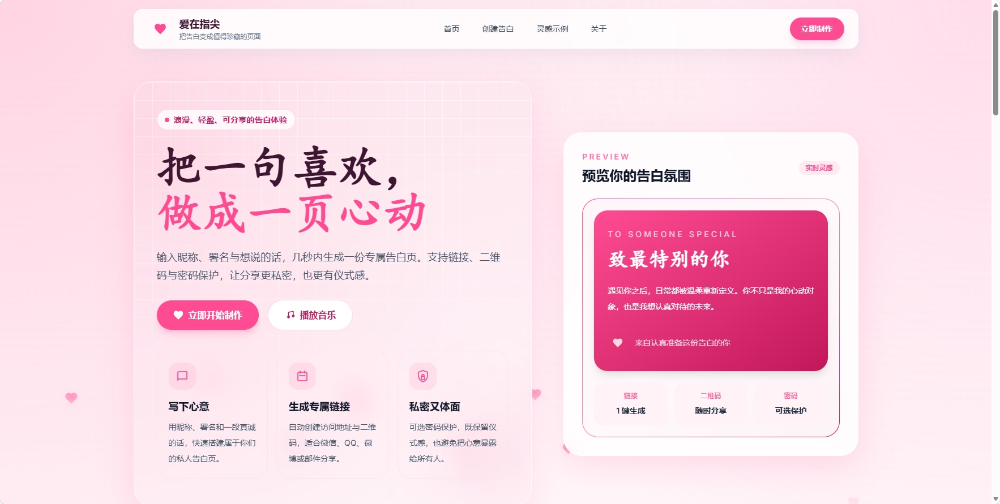
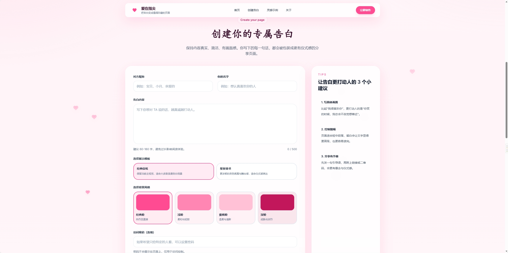
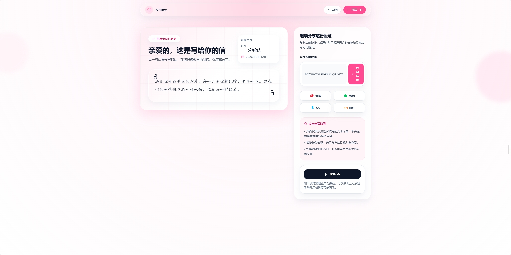
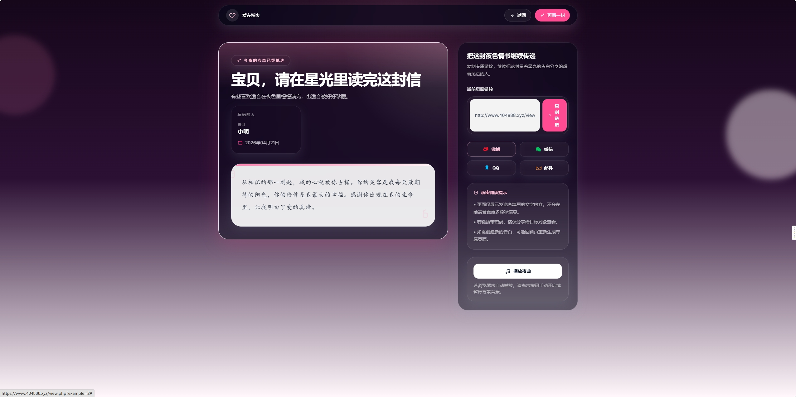

# LoveWeb


> 一个更有仪式感的浪漫告白生成器。  
> 支持 **多模板展示、专属链接分享、二维码下载、访问密码**，并集成 **Cloudflare Turnstile** 防止机器人滥用提交接口。

LoveWeb 面向个人站点、小型活动页、情侣互动页和节日告白场景，目标是用尽可能轻量的方式，让“写一段告白”这件事拥有更完整的展示体验。

无需数据库，部署门槛低；支持模板扩展，后续玩法空间也足够大。

***

## 目录

- [为什么选择 LoveWeb](#为什么选择-loveweb)
- [适用场景](#适用场景)
- [核心亮点](#核心亮点)
- [项目预览](#项目预览)
- [技术栈](#技术栈)
- [快速开始](#快速开始)
- [项目结构](#项目结构)
- [模板系统说明](#模板系统说明)
- [Turnstile 配置](#turnstile-配置)
- [数据存储说明](#数据存储说明)
- [部署建议](#部署建议)
- [安全说明](#安全说明)
- [后续可扩展方向](#后续可扩展方向)
- [License](#license)
- [致谢](#致谢)

***

## 为什么选择 LoveWeb

LoveWeb 不只是一个“表单 + 详情页”的小项目，它更像是一套轻量级的告白页面生成方案：

- **更有展示感**：从填写内容到生成专属页面，流程完整、分享自然
- **更易扩展**：模板目录自动扫描，新增模板不需要改一堆业务代码
- **更适合快速部署**：基于 PHP + JSON 文件存储，无数据库也能跑起来
- **更适合公开分享**：支持链接复制、二维码下载、访问密码与分享入口
- **更安全一些**：集成 Turnstile，减少机器人或脚本恶意调用保存接口

如果你想做一个有氛围感、部署轻、又方便继续改造的小型互动页面项目，LoveWeb 是一个很合适的起点。

***

## 适用场景

你可以把 LoveWeb 用在这些场景中：

- 情人节告白页
- 纪念日惊喜页面
- 情侣互动分享页
- 节日活动落地页
- 个人作品展示项目
- 轻量级 H5 风格网页原型

它尤其适合：

- 想快速上线一个有视觉效果的小项目
- 不想先搭数据库和后台
- 希望后续自己继续加模板、换风格、改交互

***

## 核心亮点

### 表达体验
- 自定义对方昵称、署名和告白内容
- 支持背景风格切换
- 支持多模板展示
- 支持访问密码保护

### 分享体验
- 自动生成专属访问链接
- 支持二维码展示与下载
- 提供常见社交分享入口
- 适合直接发给对方打开查看

### 系统能力
- 模板目录自动扫描
- 首页模板列表自动生成
- JSON 轻量存储
- Cloudflare Turnstile 防机器人提交
- 基于 PHP 的轻量部署方案

***

## 项目预览

LoveWeb 提供一套从“填写告白内容”到“生成专属分享页”的完整流程：

1. 在首页填写对方昵称、你的署名和告白内容
2. 选择展示模板与背景风格
3. 可选设置访问密码
4. 生成人机验证通过后提交
5. 自动生成专属链接与二维码
6. 将页面分享给对方查看

项目当前已经支持模板化展示机制，并且首页模板列表会根据模板配置自动生成，后续扩展模板成本较低。

### 推荐截图版式

你可以在发布到 GitHub 前，按下面的版式补充截图：

#### 首页创建页


#### 告白详情页


#### 多模板对比



***

## 技术栈

### 前端
- HTML5
- Tailwind CSS（CDN）
- 原生 JavaScript
- qrcode.js

### 后端
- PHP
- cURL

### 数据存储
- JSON 文件存储

### 安全与验证
- Cloudflare Turnstile

***

## 快速开始

### 运行要求

- PHP 7.4 及以上版本（推荐 PHP 8+）
- 启用 PHP `curl` 扩展
- 支持静态文件与 PHP 的 Web 环境

### 启动方式

如果你本地已安装 PHP，可以在项目根目录运行：

```bash
php -S localhost:8000
```

然后访问：

```text
http://localhost:8000/index.html
```

### 首次运行说明

- `confessions` 目录会在首次保存告白时自动创建
- 模板列表会在页面加载时由 `templates.php` 动态返回
- 如果未正确配置 Turnstile，保存接口会拒绝写入数据

***

## 项目结构

```text
LoveWeb/
├─ index.html
├─ save.php
├─ view.php
├─ template-registry.php
├─ templates.php
├─ 404.html
├─ templates/
│  ├─ default/
│  │  ├─ config.php
│  │  └─ template.html
│  └─ romantic/
│     ├─ config.php
│     └─ template.html
├─ confessions/
│  └─ *.json
└─ docs/
   └─ superpowers/
      └─ plans/
```

### 关键文件说明

- `index.html`：项目首页，负责填写告白内容、选择模板、生成分享链接
- `save.php`：保存告白数据，并执行 Turnstile 服务端校验
- `view.php`：读取已生成的告白数据并按模板渲染展示页
- `template-registry.php`：扫描 `templates` 目录并注册可用模板
- `templates.php`：提供模板列表接口，供首页动态加载模板
- `templates/<name>/config.php`：模板配置文件
- `templates/<name>/template.html`：模板 HTML 文件
- `confessions/*.json`：生成后的告白数据文件
- `404.html`：自定义 404 页面

***

## 模板系统说明

本项目支持模板化展示，并已实现模板自动发现机制。

### 模板目录结构

每个模板必须位于：

```text
templates/<template-name>/
```

并至少包含两个文件：

```text
config.php
template.html
```

### `config.php` 的职责

模板配置文件负责提供：

- 模板名称
- 模板简介
- 预览描述
- 是否为默认模板
- 展示页文案配置
- 背景音乐地址等

### `template.html` 的职责

模板 HTML 文件负责定义展示页结构，通过占位符由 `view.php` 注入实际数据。

### 新增模板的方法

1. 在 `templates/` 下创建新目录，例如：

```text
templates/dreamy/
```

2. 添加：

```text
templates/dreamy/config.php
templates/dreamy/template.html
```

3. 按现有模板配置补齐所需字段

完成后系统会自动：

- 扫描并注册新模板
- 在首页模板选择区显示该模板
- 允许保存时选择该模板
- 在 `view.php` 中按模板进行渲染

这也是 LoveWeb 相比普通静态页面更有可玩性的地方：你可以把它当成一个小型模板化页面系统继续扩展。

***

## Turnstile 配置

项目已集成 Cloudflare Turnstile，用于防止机器人或脚本恶意调用 `save.php`。

### 前端

前端页面会加载 Turnstile 组件，并在提交时携带验证 token。

### 后端

后端 `save.php` 会调用 Cloudflare 官方接口校验 token，通过后才允许保存告白内容。

### 推荐做法

请不要把真实 secret key 提交到仓库中。建议使用以下方式管理：

- 服务器环境变量
- Web 面板环境配置
- 部署平台 Secret 配置

例如建议使用环境变量：

```bash
TURNSTILE_SECRET_KEY=your_secret_key_here
```

### 部署时注意

- 必须启用 PHP `curl`
- 确保服务器可以访问 Cloudflare Turnstile 校验接口
- 前端 site key 与后端 secret key 必须匹配

***

## 数据存储说明

项目使用 JSON 文件存储每一条告白数据。

### 存储形式

每次生成成功后，会在 `confessions/` 目录下创建一个 JSON 文件，例如：

```text
confessions/xxxxxxxxxxxx.json
```

### 包含内容

通常会包含以下字段：

- `id`
- `recipient`
- `sender`
- `message`
- `bgColor`
- `template`
- `timestamp`
- `password`

### 适用场景

这种存储方式适合：

- 个人项目
- 轻量活动页
- 小流量场景
- 无数据库的快速部署

如果你准备把它用于更高并发的正式场景，建议后续迁移为数据库存储。

***

## 部署建议

推荐部署到支持 PHP 的环境中，例如：

- 宝塔 / LNMP / LAMP
- Apache / Nginx + PHP-FPM
- 支持 PHP 的虚拟主机
- 自建 VPS

### 建议部署配置

- 开启 HTTPS
- 启用 PHP `curl`
- 正确配置 Turnstile secret
- 为 `confessions` 目录设置合理权限
- 禁止直接暴露不应公开的数据文件

### 线上使用建议

- 开启日志记录便于排查提交失败
- 对 `save.php` 保留速率限制
- 使用真实域名配置 Turnstile
- 定期检查模板配置和存储目录权限

***

## 后续可扩展方向

如果你准备继续维护这个项目，后续可以考虑增加：

- 模板预览图
- 模板分类标签
- 后台管理页面
- 告白列表管理
- 数据库存储
- 邮件通知或提醒功能
- 多语言支持
- 移动端体验优化

***

## License

- MIT License

***

## 致谢

本项目依赖或参考了以下服务/库：

- [Cloudflare Turnstile](https://developers.cloudflare.com/turnstile/)
- [qrcode.js](https://github.com/davidshimjs/qrcodejs)
- [Tailwind CSS](https://tailwindcss.com/)

***

如果你觉得这个项目对你有帮助，欢迎基于它继续扩展属于你自己的告白模板与互动玩法。
